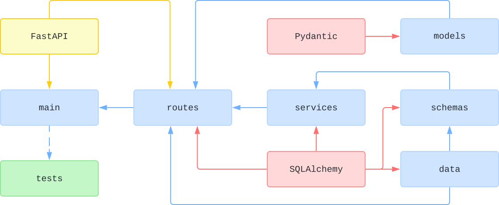
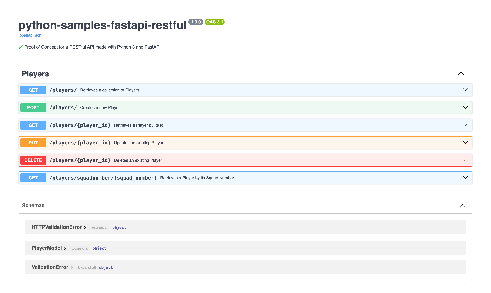

# 🧪 RESTful API with Python 3 and FastAPI

## Status

[](https://github.com/nanotaboada/python-samples-fastapi-restful/actions/workflows/python-app.yml)
[](https://sonarcloud.io/summary/new_code?id=nanotaboada_python-samples-fastapi-restful)
[](https://app.codacy.com/gh/nanotaboada/python-samples-fastapi-restful/dashboard?utm_source=gh&utm_medium=referral&utm_content=&utm_campaign=Badge_grade)
[](https://codecov.io/gh/nanotaboada/python-samples-fastapi-restful)
[](https://www.codefactor.io/repository/github/nanotaboada/python-samples-fastapi-restful)
[](https://github.com/psf/black)

## About

Proof of Concept for a RESTful API made with [Python 3](https://www.python.org/) and [FastAPI](https://fastapi.tiangolo.com/).

## Structure



_Figure: Simplified, conceptual project structure and main application flow. Not all dependencies are shown._

## Install

```console
pip install -r requirements.txt
pip install -r requirements-lint.txt
pip install -r requirements-test.txt
```

## Start

```console
uvicorn main:app --reload --port 9000
```

## Docs

```console
http://localhost:9000/docs
```



## Container

### Docker Compose

This setup uses [Docker Compose](https://docs.docker.com/compose/) to build and run the app and manage a persistent SQLite database stored in a Docker volume.

#### Build the image

```bash
docker compose build
```

#### Start the app

```bash
docker compose up
```

> On first run, the container copies a pre-seeded SQLite database into a persistent volume
> On subsequent runs, that volume is reused and the data is preserved

#### Stop the app

```bash
docker compose down
```

#### Optional: database reset

```bash
docker compose down -v
```

> This removes the volume and will reinitialize the database from the built-in seed file the next time you `up`.

## Credits

The solution has been coded using [Visual Studio Code](https://code.visualstudio.com/) with the official [Python](https://marketplace.visualstudio.com/items?itemName=ms-python.python) extension.

## Terms

All trademarks, registered trademarks, service marks, product names, company names, or logos mentioned on this repository are the property of their respective owners. All usage of such terms herein is for identification purposes only and constitutes neither an endorsement nor a recommendation of those items. Furthermore, the use of such terms is intended to be for educational and informational purposes only.
