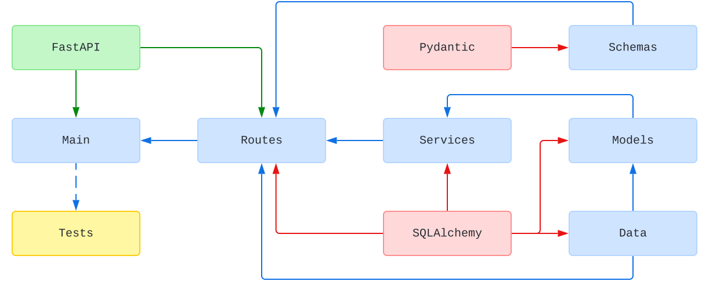

# Sample RESTful API with Python 3 and FastAPI

## Status

[](https://github.com/nanotaboada/python-samples-fastapi-restful/actions/workflows/python-app.yml)
[](https://www.codefactor.io/repository/github/nanotaboada/python-samples-fastapi-restful)
[](https://codeclimate.com/github/nanotaboada/python-samples-fastapi-restful/maintainability)
[](https://app.codacy.com/gh/nanotaboada/python-samples-fastapi-restful/dashboard?utm_source=gh&utm_medium=referral&utm_content=&utm_campaign=Badge_grade)
[](https://codecov.io/gh/nanotaboada/python-samples-fastapi-restful)

## Manifesto

> "Nobody should start to undertake a large project. You start with a small _trivial_ project, and you should never expect it to get large. If you do, you'll just overdesign and generally think it is more important than it likely is at that stage. Or worse, you might be scared away by the sheer size of the work you envision. So start small, and think about the details. Don't think about some big picture and fancy design. If it doesn't solve some fairly immediate need, it's almost certainly over-designed. And don't expect people to jump in and help you. That's not how these things work. You need to get something half-way _useful_ first, and then others will say "hey, that _almost_ works for me", and they'll get involved in the project." — Linus Torvalds

## About

Proof of Concept for a RESTful API made with [Python 3](https://www.python.org/) and [FastAPI](https://fastapi.tiangolo.com/).

## Structure

The following is a simplified dependency diagram of modules and main libraries:



## Install

```shell
pip install --requirement requirements.txt
```

## Start

```shell
uvicorn main:fast_api --reload
```

## Credits

The solution has been coded using [Visual Studio Code](https://code.visualstudio.com/).

## Terms

All trademarks, registered trademarks, service marks, product names, company names or logos are property of their respective owners and are used for educational purposes only.
