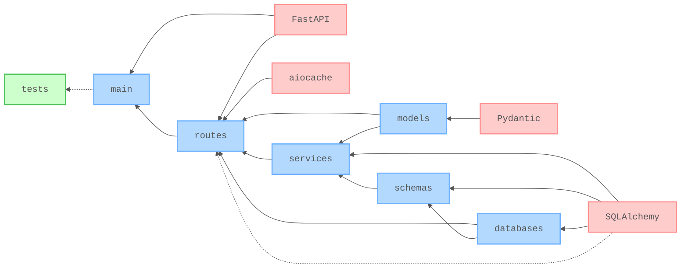

# 🧪 RESTful API with Python 3 and FastAPI

[](https://github.com/nanotaboada/python-samples-fastapi-restful/actions/workflows/python-ci.yml)
[](https://github.com/nanotaboada/python-samples-fastapi-restful/actions/workflows/python-cd.yml)
[](https://github.com/nanotaboada/python-samples-fastapi-restful/actions/workflows/codeql.yml)
[](https://sonarcloud.io/summary/new_code?id=nanotaboada_python-samples-fastapi-restful)
[](https://codecov.io/gh/nanotaboada/python-samples-fastapi-restful)
[](https://www.codefactor.io/repository/github/nanotaboada/python-samples-fastapi-restful)
[](https://opensource.org/licenses/MIT)
[](https://github.com/psf/black)


Proof of Concept for a RESTful API built with [Python 3](https://www.python.org/) and [FastAPI](https://fastapi.tiangolo.com/). Manage football player data with SQLite, SQLAlchemy 2.0 (async), Pydantic validation, and in-memory caching.

## Table of Contents

- [Features](#features)
- [Tech Stack](#tech-stack)
- [Project Structure](#project-structure)
- [Architecture](#architecture)
- [API Reference](#api-reference)
- [Prerequisites](#prerequisites)
- [Quick Start](#quick-start)
- [Testing](#testing)
- [Docker](#docker)
- [Releases](#releases)
- [Environment Variables](#environment-variables)
- [Command Summary](#command-summary)
- [Contributing](#contributing)
- [Legal](#legal)

## Features

- 🏗️ **Modern async architecture** - Async/await throughout, Pydantic validation, and SQLAlchemy 2.0 patterns
- 📚 **Interactive API exploration** - Auto-generated OpenAPI docs with FastAPI's built-in Swagger UI and `.rest` file for REST Client integration
- ⚡ **Performance optimizations** - Async SQLAlchemy, in-memory caching with aiocache (10-minute TTL), and efficient database operations
- 🧪 **High test coverage** - Pytest suite with 80% minimum coverage and automated reporting to Codecov and SonarCloud
- 📖 **Agent-optimized documentation** - Claude Code and GitHub Copilot instructions with coding guidelines, architecture rules, and agent workflows for AI-assisted development
- 🐳 **Full containerization** - Production-ready Docker setup with Docker Compose orchestration
- 🔄 **Complete CI/CD pipeline** - Automated linting (Black/Flake8), testing, Docker publishing, and GitHub releases
- ♟️ **Coach-themed semantic versioning** - Memorable, alphabetical release names honoring legendary football coaches

## Tech Stack

| Category | Technology |
| -------- | ---------- |
| **Language** | [Python 3.13](https://www.python.org/) |
| **Web Framework** | [FastAPI](https://fastapi.tiangolo.com/) + [Uvicorn](https://www.uvicorn.org/) |
| **ORM** | [SQLAlchemy 2.0 (async)](https://docs.sqlalchemy.org/en/20/) + [aiosqlite](https://github.com/omnilib/aiosqlite) |
| **Database** | [SQLite](https://www.sqlite.org/) |
| **Validation** | [Pydantic](https://docs.pydantic.dev/) |
| **Caching** | [aiocache](https://github.com/aio-libs/aiocache) (in-memory, 10-minute TTL) |
| **Testing** | [pytest](https://pytest.org/) + [pytest-cov](https://github.com/pytest-dev/pytest-cov) + [httpx](https://www.python-httpx.org/) |
| **Linting / Formatting** | [Flake8](https://flake8.pycqa.org/) + [Black](https://black.readthedocs.io/) |
| **Containerization** | [Docker](https://www.docker.com/) & [Docker Compose](https://docs.docker.com/compose/) |

## Project Structure

```text
/
├── main.py                 # Entry point: FastAPI setup, router registration
├── routes/                 # HTTP route definitions, dependency injection + caching
│   ├── player_route.py
│   └── health_route.py
├── services/               # Async business logic
│   └── player_service.py
├── schemas/                # SQLAlchemy ORM models (database schema)
│   └── player_schema.py
├── databases/              # Async SQLAlchemy session setup
│   └── player_database.py
├── models/                 # Pydantic models for request/response validation
│   └── player_model.py
├── tests/                  # pytest integration tests
│   ├── conftest.py
│   ├── player_stub.py
│   └── test_main.py
├── rest/                   # HTTP request files
│   └── players.rest        # CRUD requests (REST Client / JetBrains HTTP Client)
├── storage/                # SQLite database file (pre-seeded)
├── scripts/                # Container entrypoint & healthcheck
└── .github/workflows/      # CI/CD pipelines
```

## Architecture

Layered architecture with dependency injection via FastAPI's `Depends()` mechanism and Pydantic for request/response validation.


```mermaid
%%{init: {
  "theme": "default",
  "themeVariables": {
    "fontFamily": "Fira Code, Consolas, monospace",
    "textColor": "#555",
    "lineColor": "#555"
  }
}}%%

graph RL

    tests[tests]

    main[main]
    routes[routes]
    fastapi[FastAPI]
    aiocache[aiocache]

    services[services]

    models[models]
    pydantic[Pydantic]

    schemas[schemas]

    databases[databases]
    sqlalchemy[SQLAlchemy]

    %% Strong dependencies

    routes --> main
    fastapi --> main

    fastapi --> routes
    aiocache --> routes
    services --> routes
    models --> routes
    databases --> routes

    schemas --> services
    models --> services
    sqlalchemy --> services
    pydantic --> models

    databases --> schemas
    sqlalchemy --> schemas
    sqlalchemy --> databases

    %% Soft dependencies

    sqlalchemy -.-> routes
    main -.-> tests

    %% Node styling with stroke-width
    classDef core fill:#b3d9ff,stroke:#6db1ff,stroke-width:2px,color:#555,font-family:monospace;
    classDef deps fill:#ffcccc,stroke:#ff8f8f,stroke-width:2px,color:#555,font-family:monospace;
    classDef test fill:#ccffcc,stroke:#53c45e,stroke-width:2px,color:#555,font-family:monospace;

    class main,routes,services,schemas,databases,models core
    class fastapi,sqlalchemy,pydantic,aiocache deps
    class tests test
```

*Simplified, conceptual view — not all components or dependencies are shown.*

### Arrow Semantics

Arrows point from a dependency toward its consumer. Solid arrows (`-->`) denote **strong (functional) dependencies**: the consumer actively invokes behavior — registering route handlers, dispatching requests, executing async queries, or managing the database session. Dotted arrows (`-.->`) denote **soft (structural) dependencies**: the consumer only references types without invoking runtime behavior. This distinction follows UML's `«use»` dependency notation and classical coupling theory (Myers, 1978): strong arrows approximate *control or stamp coupling*, while soft arrows approximate *data coupling*, where only shared data structures cross the boundary.

### Composition Root Pattern

The `main` module acts as the composition root — it creates the FastAPI application instance, configures the lifespan handler, and registers all route modules via `app.include_router()`. Rather than explicit object construction, dependency injection is provided by FastAPI's built-in `Depends()` mechanism: `routes` declare their dependencies (e.g. `AsyncSession`) as function parameters and FastAPI resolves them at request time. This pattern enables dependency injection, improves testability, and ensures no other module bears responsibility for wiring or lifecycle management.

### Layered Architecture

The codebase is organized into four conceptual layers: Initialization (`main`), HTTP (`routes`), Business (`services`), and Data (`schemas`, `databases`).

Third-party dependencies are co-resident within the layer that consumes them: `FastAPI` and `aiocache` inside HTTP, and `SQLAlchemy` inside Data. `routes` holds a soft dependency on `SQLAlchemy` — `AsyncSession` is referenced only as a type annotation in `Depends()`, without any direct SQLAlchemy method calls at the route level.

The `models` package is a **cross-cutting type concern** — it defines Pydantic request and response models consumed across multiple layers, without containing logic or behavior of its own. Dependencies always flow from consumers toward their lower-level types: each layer depends on (consumes) the layers below it, and no layer invokes behavior in a layer above it.

### Color Coding

Core packages (blue) implement the application logic, third-party dependencies (red) are community packages, and tests (green) ensure code quality.

## API Reference

Interactive API documentation is available via Swagger UI at `http://localhost:9000/docs` when the server is running.

**Quick Reference:**

- `GET /players/` — List all players
- `GET /players/{player_id}` — Get player by UUID (surrogate key)
- `GET /players/squadnumber/{squad_number}` — Get player by squad number (natural key)
- `POST /players/` — Create a new player
- `PUT /players/squadnumber/{squad_number}` — Update an existing player
- `DELETE /players/squadnumber/{squad_number}` — Remove a player
- `GET /health` — Health check

### HTTP Requests

A ready-to-use HTTP request file is available at [`rest/players.rest`](rest/players.rest). It covers all CRUD operations and can be run directly from your editor without leaving the development environment:

- **VS Code** — install the [REST Client](https://marketplace.visualstudio.com/items?itemName=humao.rest-client) extension (`humao.rest-client`), open `rest/players.rest`, and click **Send Request** above any entry.
- **JetBrains IDEs** (IntelliJ IDEA, PyCharm, WebStorm) — the built-in HTTP Client supports `.rest` files natively; no plugin required.

The file targets `http://localhost:9000` by default.

## Prerequisites

Before you begin, ensure you have the following installed:

- **Python 3.13+** — uses `.python-version` for automatic activation with [pyenv](https://github.com/pyenv/pyenv), [asdf](https://asdf-vm.com/), or [mise](https://mise.jdx.dev/)
- **[uv](https://docs.astral.sh/uv/)** (recommended) — fast Python package and project manager
- **Docker & Docker Compose** (optional, for containerized deployment)

## Quick Start

### Clone the repository

```bash
git clone https://github.com/nanotaboada/python-samples-fastapi-restful.git
cd python-samples-fastapi-restful
```

### Install dependencies

Dependencies are defined in `pyproject.toml` using [PEP 735](https://peps.python.org/pep-0735/) dependency groups.

```bash
# Install uv (if you haven't already)
curl -LsSf https://astral.sh/uv/install.sh | sh

# Create a virtual environment and install all dependencies
uv venv
source .venv/bin/activate  # On Windows: .venv\Scripts\activate
uv pip install --group dev
```

Or with specific groups:

| Command | Description |
| ------- | ----------- |
| `uv pip install` | Production dependencies only |
| `uv pip install --group test` | Test dependencies |
| `uv pip install --group lint` | Linting dependencies |
| `uv pip install --group dev` | All (test + lint + production) |

### Start the development server

```bash
uv run uvicorn main:app --reload --port 9000
```

The server will start on `http://localhost:9000`.

### Access the application

- **API:** `http://localhost:9000`
- **Swagger Documentation:** `http://localhost:9000/docs`
- **Health Check:** `http://localhost:9000/health`

## Testing

Run the test suite with coverage:

```bash
# Run all tests
uv run pytest

# Run tests with verbose output
uv run pytest -v

# Run tests with coverage report
uv run pytest --cov=./ --cov-report=term
```

Tests are located in the `tests/` directory and use `httpx` for async integration testing. Coverage reports are generated for routes, services, and databases.

**Coverage target:** 80% minimum.

## Docker

This project includes full Docker support with Docker Compose for easy deployment.

### Build the Docker image

```bash
docker compose build
```

### Start the application

```bash
docker compose up
```

> 💡 On first run, the container copies a pre-seeded SQLite database into a persistent volume. On subsequent runs, that volume is reused and the data is preserved.

### Stop the application

```bash
docker compose down
```

### Reset the database

To remove the volume and reinitialize the database from the built-in seed file:

```bash
docker compose down -v
```

The containerized application runs on port 9000 and includes health checks that monitor the `/health` endpoint.

## Releases

This project uses famous football coaches as release codenames ♟️, following an A-Z naming pattern.

### Release Naming Convention

Releases follow the pattern: `v{SEMVER}-{COACH}` (e.g., `v1.0.0-ancelotti`)

- **Semantic Version**: Standard versioning (MAJOR.MINOR.PATCH)
- **Coach Name**: Alphabetically ordered codename from the [famous coach list](CHANGELOG.md)

### Create a Release

To create a new release, follow this workflow:

#### 1. Create a Release Branch

```bash
git checkout -b release/v1.0.0-ancelotti
```

#### 2. Update CHANGELOG.md

Document your changes in [CHANGELOG.md](CHANGELOG.md):

```bash
# Move items from [Unreleased] to new release section
# Example: [1.0.0 - Ancelotti] - 2026-02-15
git add CHANGELOG.md
git commit -m "docs(changelog): release v1.0.0 Ancelotti"
git push origin release/v1.0.0-ancelotti
```

#### 3. Create and Push Tag

Then create and push the version tag:

```bash
git tag -a v1.0.0-ancelotti -m "Release 1.0.0 - Ancelotti"
git push origin v1.0.0-ancelotti
```

#### 4. Automated CD Workflow

This triggers the CD workflow which automatically:

1. Validates the coach name
2. Builds and tests the project with coverage
3. Publishes Docker images to GitHub Container Registry with three tags
4. Creates a GitHub Release with auto-generated changelog from commits

> 💡 Always update CHANGELOG.md before creating the tag. See [CHANGELOG.md](CHANGELOG.md) for detailed release instructions.

### Pull Docker Images

Each release publishes multiple tags for flexibility:

```bash
# By semantic version (recommended for production)
docker pull ghcr.io/nanotaboada/python-samples-fastapi-restful:1.0.0

# By coach name (memorable alternative)
docker pull ghcr.io/nanotaboada/python-samples-fastapi-restful:ancelotti

# Latest release
docker pull ghcr.io/nanotaboada/python-samples-fastapi-restful:latest
```

> 💡 See [CHANGELOG.md](CHANGELOG.md) for the complete coach list (A-Z) and release history.

## Environment Variables

The application can be configured using the following environment variables (declared in [`compose.yaml`](compose.yaml)):

```bash
# Database storage path (default: ./storage/players-sqlite3.db)
# In Docker: /storage/players-sqlite3.db
STORAGE_PATH=./storage/players-sqlite3.db

# Python output buffering: set to 1 for real-time logs in Docker
PYTHONUNBUFFERED=1
```

## Command Summary

| Command | Description |
| ------- | ----------- |
| `uv run uvicorn main:app --reload --port 9000` | Start development server |
| `uv pip install --group dev` | Install all dependencies |
| `uv run pytest` | Run all tests |
| `uv run pytest -v` | Run tests with verbose output |
| `uv run pytest --cov=./ --cov-report=term` | Run tests with coverage |
| `uv run flake8 .` | Lint code |
| `uv run black --check .` | Check formatting |
| `uv run black .` | Auto-format code |
| `docker compose build` | Build Docker image |
| `docker compose up` | Start Docker container |
| `docker compose down` | Stop Docker container |
| `docker compose down -v` | Stop and remove Docker volume |

## Contributing

Contributions are welcome! Please read [CONTRIBUTING.md](CONTRIBUTING.md) for details on the code of conduct and the process for submitting pull requests.

**Key guidelines:**

- Follow [Conventional Commits](https://www.conventionalcommits.org/) for commit messages
- Ensure all tests pass (`uv run pytest`)
- Run `uv run black .` before committing
- Keep changes small and focused

## Legal

This project is provided for educational and demonstration purposes and may be used in production environments at your discretion. All referenced trademarks, service marks, product names, company names, and logos are the property of their respective owners and are used solely for identification or illustrative purposes.
